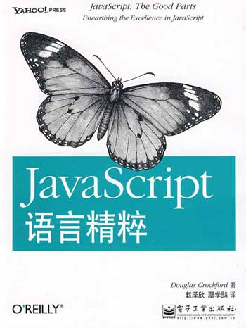

# JavaScript 的发展史

## 一. 什么是 JavaScript
&emsp;&emsp;JavaScript一种直译式脚本语言，是一种动态类型、弱类型、基于原型的语言，内置支持类型。它的解释器被称为JavaScript引擎，为浏览器的一部分，广泛用于客户端的脚本语言，最早是在 HTML（标准通用标记语言下的一个应用）网页上使用，用来给HTML网页增加动态功能。
***
## 二. 诞生
&emsp;&emsp;JavaScript因为互联网而生，紧随着浏览器的出现而问世。回顾它的历史，就要从浏览器的历史讲起。

&emsp;&emsp;1990年底，欧洲核能研究组织（CERN）科学家Tim Berners-Lee，在全世界最大的电脑网络——互联网的基础上，发明了万维网（World Wide Web），从此可以在网上浏览网页文件。最早的网页只能在操作系统的终端里浏览，也就是说只能使用命令行操作，网页都是在字符窗口中显示，这当然非常不方便。

&emsp;&emsp;1992年底，美国国家超级电脑应用中心（NCSA）开始开发一个独立的浏览器，叫做Mosaic。这是人类历史上第一个浏览器，从此网页可以在图形界面的窗口浏览。

&emsp;&emsp;1994年10月，NCSA的一个主要程序员Marc Andreessen联合风险投资家Jim Clark，成立了Mosaic通信公司（Mosaic Communications），不久后改名为Netscape。这家公司的方向，就是在Mosaic的基础上，开发面向普通用户的新一代的浏览器Netscape Navigator。

&emsp;&emsp;1994年12月，Navigator发布了1.0版，市场份额一举超过90%。

&emsp;&emsp;Netscape公司很快发现，Navigator浏览器需要一种可以嵌入网页的脚本语言，用来控制浏览器行为。当时，网速很慢而且上网费很贵，有些操作不宜在服务器端完成。比如，如果用户忘记填写“用户名”，就点了“发送”按钮，到服务器再发现这一点就有点太晚了，最好能在用户发出数据之前，就告诉用户“请填写用户名”。这就需要在网页中嵌入小程序，让浏览器检查每一栏是否都填写了。

&emsp;&emsp;管理层对这种浏览器脚本语言的设想是：功能不需要太强，语法较为简单，容易学习和部署。那一年，正逢Sun公司的Java语言问世，市场推广活动非常成功。Netscape公司决定与Sun公司合作，浏览器支持嵌入Java小程序（后来称为Java applet）。但是，浏览器脚本语言是否就选用Java，则存在争论。后来，还是决定不使用Java，因为网页小程序不需要Java这么“重”的语法。但是，同时也决定脚本语言的语法要接近Java，并且可以支持Java程序。这些设想直接排除了使用现存语言，比如Perl、Python和TCL。

&emsp;&emsp;1995年，Netscape公司雇佣了程序员Brendan Eich开发这种网页脚本语言。Brendan Eich有很强的函数式编程背景，希望以Scheme语言（函数式语言鼻祖LISP语言的一种方言）为蓝本，实现这种新语言。
<br>

1995年5月，Brendan Eich只用了10天，就设计完成了这种语言的第一版。它是一个大杂烩，语法有多个来源：

* 基本语法：借鉴C语言和Java语言。
* 数据结构：借鉴Java语言，包括将值分成原始值和对象两大类。
* 函数的用法：借鉴Scheme语言和Awk语言，将函数当作第一等公民，并引入闭包。
原型继承模型：借鉴Self语言（Smalltalk的一种变种）。
* 正则表达式：借鉴Perl语言。
* 字符串和数组处理：借鉴Python语言。

&emsp;&emsp;为了保持简单，这种脚本语言缺少一些关键的功能，比如块级作用域、模块、子类型（subtyping）等等，但是可以利用现有功能找出解决办法。这种功能的不足，直接导致了后来JavaScript的一个显著特点：对于其他语言，你需要学习语言的各种功能，而对于JavaScript，你常常需要学习各种解决问题的模式。而且由于来源多样，从一开始就注定，JavaScript的编程风格是函数式编程和面向对象编程的一种混合体。

&emsp;&emsp;Netscape公司的这种浏览器脚本语言，最初名字叫做Mocha，1995年9月改为LiveScript。12月，Netscape公司与Sun公司（Java语言的发明者和所有者）达成协议，后者允许将这种语言叫做JavaScript。这样一来，Netscape公司可以借助Java语言的声势，而Sun公司则将自己的影响力扩展到了浏览器。

&emsp;&emsp;之所以起这个名字，并不是因为JavaScript本身与Java语言有多么深的关系（事实上，两者关系并不深），而是因为Netscape公司已经决定，使用Java语言开发网络应用程序，JavaScript可以像胶水一样，将各个部分连接起来。当然，后来的历史是Java语言的浏览器插件失败了，JavaScript反而发扬光大。

&emsp;&emsp;1995年12月4日，Netscape公司与Sun公司联合发布了JavaScript语言。

&emsp;&emsp;1996年3月，Navigator 2.0浏览器正式内置了JavaScript脚本语言。
***
## 三、JavaScript的版本
&emsp;&emsp;1997年7月，ECMAScript 1.0发布。

&emsp;&emsp;1998年6月，ECMAScript 2.0版发布。

&emsp;&emsp;1999年12月，ECMAScript 3.0版发布，成为JavaScript的通行标准，得到了广泛支持。

&emsp;&emsp;2007年10月，ECMAScript 4.0版草案发布，对3.0版做了大幅升级，预计次年8月发布正式版本。草案发布后，由于4.0版的目标过于激进，各方对于是否通过这个标准，发生了严重分歧。以Yahoo、Microsoft、Google为首的大公司，反对JavaScript的大幅升级，主张小幅改动；以JavaScript创造者Brendan Eich为首的Mozilla公司，则坚持当前的草案。

&emsp;&emsp;2008年7月，由于对于下一个版本应该包括哪些功能，各方分歧太大，争论过于激进，ECMA开会决定，中止ECMAScript 4.0的开发（即废除了这个版本），将其中涉及现有功能改善的一小部分，发布为ECMAScript 3.1，而将其他激进的设想扩大范围，放入以后的版本，由于会议的气氛，该版本的项目代号起名为Harmony（和谐）。会后不久，ECMAScript 3.1就改名为ECMAScript 5。

&emsp;&emsp;2009年12月，ECMAScript 5.0版正式发布。Harmony项目则一分为二，一些较为可行的设想定名为JavaScript.next继续开发，后来演变成ECMAScript 6；一些不是很成熟的设想，则被视为JavaScript.next.next，在更远的将来再考虑推出。TC39的总体考虑是，ECMAScript 5与ECMAScript 3基本保持兼容，较大的语法修正和新功能加入，将由JavaScript.next完成。当时，JavaScript.next指的是ECMAScript 6。第六版发布以后，将指ECMAScript 7。TC39预计，ECMAScript 5会在2013年的年中成为JavaScript开发的主流标准，并在此后五年中一直保持这个位置。

&emsp;&emsp;2011年6月，ECMAscript 5.1版发布，并且成为ISO国际标准（ISO/IEC 16262:2011）。到了2012年底，所有主要浏览器都支持ECMAScript 5.1版的全部功能。

&emsp;&emsp;2013年3月，ECMAScript 6草案冻结，不再添加新功能。新的功能设想将被放到ECMAScript 7。

&emsp;&emsp;2013年12月，ECMAScript 6草案发布。然后是12个月的讨论期，听取各方反馈。

&emsp;&emsp;2015年6月，ECMAScript 6正式发布，并且更名为“ECMAScript 2015”。这是因为TC39委员会计划，以后每年发布一个ECMAScirpt的版本，下一个版本在2016年发布，称为“ECMAScript 2016”。

&emsp;&emsp;除了ECMAScript的版本，很长一段时间中，Netscape公司（以及继承它的Mozilla基金会）在内部依然使用自己的版本号。这导致了JavaScript有自己不同于ECMAScript的版本号。1996年3月，Navigator 2.0内置了JavaScript 1.0。JavaScript 1.1版对应ECMAScript 1.0，但是直到JavaScript 1.4版才完全兼容ECMAScript 1.0。JavaScript 1.5版完全兼容ECMAScript 3.0。目前的JavaScript 1.8版完全兼容ECMAScript 5。

## 四. Javascript 的10个设计缺陷
### 1. 设计阶段过于仓促

&emsp;&emsp;Javascript的设计，其实只用了十天。而且，设计师是为了向公司交差，本人并不愿意这样设计（参见《Javascript诞生记》）。

&emsp;&emsp;另一方面，这种语言的设计初衷，是为了解决一些简单的网页互动（比如，检查"用户名"是否填写），并没有考虑复杂应用的需要。设计者做梦也想不到，Javascript将来可以写出像Gmail这种极其庞大复杂的网页。

### 2. 没有先例

&emsp;&emsp;Javascript同时结合了函数式编程和面向对象编程的特点，这很可能是历史上的第一例。而且直到今天为止，Javascript仍然是世界上唯一使用Prototype继承模型的主要语言。这使得它没有设计先例可以参考。

### 3. 过早的标准化

&emsp;&emsp;Javascript的发展非常快，根本没有时间调整设计。

&emsp;&emsp;1995年5月，设计方案定稿；10月，解释器开发成功；12月，向市场推出，立刻被广泛接受，全世界的用户大量使用。Javascript缺乏一个从小到大、慢慢积累用户的过程，而是连续的爆炸式扩散增长。大量的既成网页和业余网页设计者的参与，使得调整语言规格困难重重。

&emsp;&emsp;更糟的是，Javascript的规格还没来及调整，就固化了。

&emsp;&emsp;1996年8月，微软公司强势介入，宣布推出自己的脚本语言Jscript；11月，为了压制微软，网景公司决定申请Javascript的国际标准；1997年6月，第一个国际标准ECMA-262正式颁布。

&emsp;&emsp;也就是说，Javascript推出一年半之后，国际标准就问世了。设计缺陷还没有充分暴露就成了标准。相比之下，C语言问世将近20年之后，国际标准才颁布。

二、Javascript的10个设计缺陷



### 1. 不适合开发大型程序

&emsp;&emsp;Javascript没有名称空间（namespace），很难模块化；没有如何将代码分布在多个文件的规范；允许同名函数的重复定义，后面的定义可以覆盖前面的定义，很不利于模块化加载。

### 2. 非常小的标准库

&emsp;&emsp;Javascript提供的标准函数库非常小，只能完成一些基本操作，很多功能都不具备。

### 3. null和undefined

&emsp;&emsp;null属于对象（object）的一种，意思是该对象为空；undefined则是一种数据类型，表示未定义。
```
　　typeof null; // object
　　typeof undefined; // undefined
```
&emsp;&emsp;两者非常容易混淆，但是含义完全不同。
```
　　var foo;
　　alert(foo == null); // true
　　alert(foo == undefined); // true
　　alert(foo === null); // false
　　alert(foo === undefined); // true
```
&emsp;&emsp;在编程实践中，null几乎没用，根本不应该设计它。

### 4. 全局变量难以控制

&emsp;&emsp;Javascript的全局变量，在所有模块中都是可见的；任何一个函数内部都可以生成全局变量，这大大加剧了程序的复杂性。
```
　　a = 1;
　　(function(){
　　　　b=2;
　　　　alert(a);
　　})(); // 1
　　alert(b); //2
```
### 5. 自动插入行尾分号

&emsp;&emsp;Javascript的所有语句，都必须以分号结尾。但是，如果你忘记加分号，解释器并不报错，而是为你自动加上分号。有时候，这会导致一些难以发现的错误。

&emsp;&emsp;比如，下面这个函数根本无法达到预期的结果，返回值不是一个对象，而是undefined。
```
　　function(){
　　　　return
　　　　　　{
　　　　　　　　i=1
　　　　　　};
　　}
```
&emsp;&emsp;原因是解释器自动在return语句后面加上了分号。
```
　　function(){
　　　　return;
　　　　　　{
　　　　　　　　i=1
　　　　　　};
　　}
```
### 6. 加号运算符

&emsp;&emsp;+号作为运算符，有两个含义，可以表示数字与数字的和，也可以表示字符与字符的连接。
```
　　alert(1+10); // 11
　　alert("1"+"10"); // 110
```
&emsp;&emsp;如果一个操作项是字符，另一个操作项是数字，则数字自动转化为字符。
```
　　alert(1+"10"); // 110
　　alert("10"+1); // 101
```
&emsp;&emsp;这样的设计，不必要地加剧了运算的复杂性，完全可以另行设置一个字符连接的运算符。

### 7. NaN

&emsp;&emsp;NaN是一种数字，表示超出了解释器的极限。它有一些很奇怪的特性：
```
　　NaN === NaN; //false
　　NaN !== NaN; //true
　　alert( 1 + NaN ); // NaN
```
&emsp;&emsp;与其设计NaN，不如解释器直接报错，反而有利于简化程序。

### 8. 数组和对象的区分

&emsp;&emsp;由于Javascript的数组也属于对象（object），所以要区分一个对象到底是不是数组，相当麻烦。Douglas Crockford的代码是这样的：
```
　　if ( arr &&
　　　　typeof arr === 'object' &&
　　　　typeof arr.length === 'number' &&
　　　　!arr.propertyIsEnumerable('length')){
　　　　alert("arr is an array");
　　}
```
### 9. == 和 ===

&emsp;&emsp;==用来判断两个值是否相等。当两个值类型不同时，会发生自动转换，得到的结果非常不符合直觉。
```
　　"" == "0" // false
　　0 == "" // true
　　0 == "0" // true
　　false == "false" // false
　　false == "0" // true
　　false == undefined // false
　　false == null // false
　　null == undefined // true
　　" \t\r\n" == 0 // true
```
&emsp;&emsp;因此，推荐任何时候都使用"==="（精确判断）比较符。

### 10. 基本类型的包装对象

&emsp;&emsp;Javascript有三种基本数据类型：字符串、数字和布尔值。它们都有相应的建构函数，可以生成字符串对象、数字对象和布尔值对象。
```
　　new Boolean(false);
　　new Number(1234);
　　new String("Hello World");
```
&emsp;&emsp;与基本数据类型对应的对象类型，作用很小，造成的混淆却很大。
```
　　alert( typeof 1234); // number
　　alert( typeof new Number(1234)); // object
```
&emsp;&emsp;来自[《JavaScript 标准参考教程（alpha）》](http://javascript.ruanyifeng.com/)，by 阮一峰